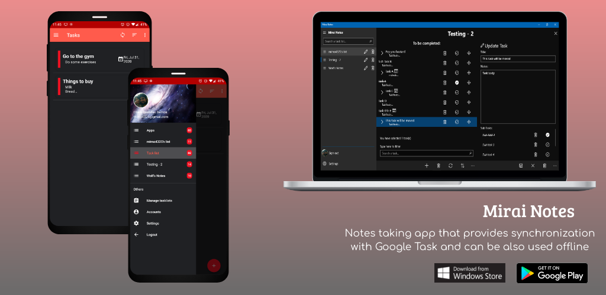
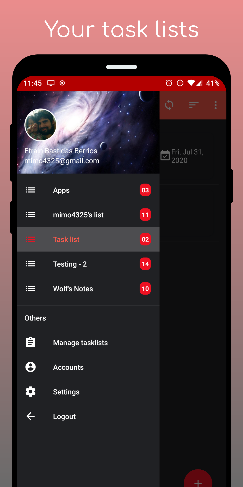
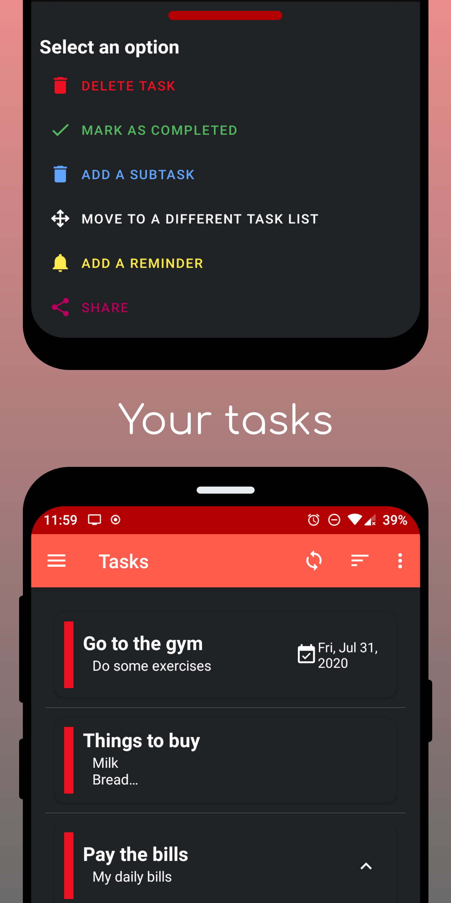
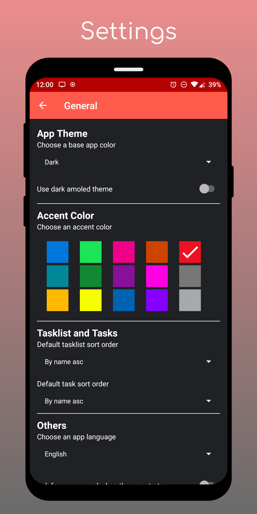

<h1 align="center">Mirai Notes</h1>
<p align="center">
  
</p>

A simple UWP / Android notes app that provides synchronization with Google Task and can be also used offline.
[](https://appcenter.ms)
### Screenshots

<p align="center">
  
</p>

<p align="center">
  
  
  
</p>


### Features
* All the Google Task features: 
  *  Create task lists
  * Create task and subtasks
  * Delete/Update/Move tasks and subtasks
  *   Etc...
* Synchronization with Google Tasks
* Offline support
* Themes and accent colors
* Task reminders
* Password protection when the app starts
* And many more...

### Installation
#### UWP
[](https://www.microsoft.com/es-ec/p/mirai-notes/9npzxkvtsp6l?activetab=pivot:overviewtab)

#### Manual Installation
* Go into the Windows Settings -> Updates & Security ->For Developers
* Select the **Sideload apps** checkbox
* Download the latest version of the app in the [Release section](https://github.com/Wolfteam/MiraiNotes/releases) 
* Decompress the zip file into any folder
* Right-click on the **Add-AppDevPackage.ps1** file. Choose **Run with PowerShell** and follow the prompts. You will be prompted to install my developer certificate and app

* When the app package has been installed, the PowerShell window displays this message: **Your app was successfully installed**. After that just click the Start button to search for the app, and then launch it. 

#### Android
[](https://play.google.com/store/apps/details?id=com.miraisoft.notes)

### Support
If you have any bug report, suggestion, feature request, etc, please go into the [Issues section](https://github.com/Wolfteam/MiraiNotes/issues) and create a new issue. 
>**Note**: I'm looking for a new app icon, if you would like to donate one i won't stop you :D**


### Donations
I hope you are enjoying using this app, If you would like to support my work by buying me a coffee / beer, please send me an email

### Building / Debugging
* In the MiraiNotes.Shared project, you need to include a class called **Secrets**
and that class must include something like this:

````
    public class Secrets
    {
        //Google secrets
#if Android
        public const string ClientId = "your android client id";
        public const string ClientSecret = "leave this one empty";
        public const string RedirectUrl = "the android redirect url, used by the login service";
        public const string AppCenterSecret = "the android app center secret";
#else
        public const string ClientId = "your uwp client id";
        public const string ClientSecret = "your uwp client secret";
        public const string RedirectUrl = "the uwp redirect url, used by the login service";
#endif

        //DbSecrets
        // This size of the IV (in bytes) must = (keysize / 8).  Default keysize is 256, so the IV must be
        // 32 bytes long.  Using a 16 character string here gives us 32 bytes when converted to a byte array.
        public const string InitVector = "your_initvector";
        // This constant is used to determine the keysize of the encryption algorithm
        public const int KeySize = 256;

        public const string Password = "the db password";
    }    
````

#### UWP
* Just follow the above instructions (the ones in the Installation section) if you want to create a release package, otherwise just run in UwpDebug mode.

#### Android
* AOT does not work!
* If for some reason, you want to compile the .aab file, you need to be in AndroidRelease mode, the .keystore file must be in the same folder as the android project. 
Open a vs command prompt (visual studio currently doesnt support this format) and navigate to the MiraiNotes.Android folder. Run the following, replacing with the appropiate values:
````
msbuild /restore MiraiNotes.Android.csproj /t:SignAndroidPackage /p:Configuration=AndroidRelease /p:AndroidKeyStore=True /p:AndroidSigningKeyStore=your_keystore_file.keystore "/p:AndroidSigningStorePass=your_password" /p:AndroidSigningKeyAlias=your_keystore_file_alias "/p:AndroidSigningKeyPass=your_password"
````
