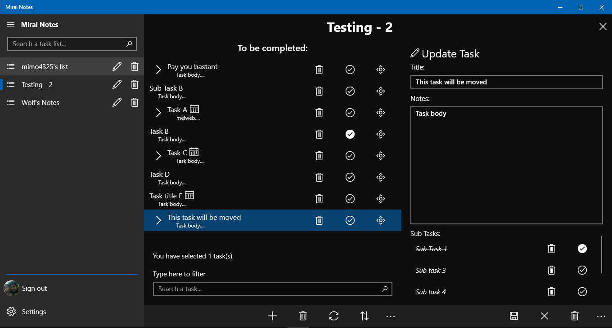
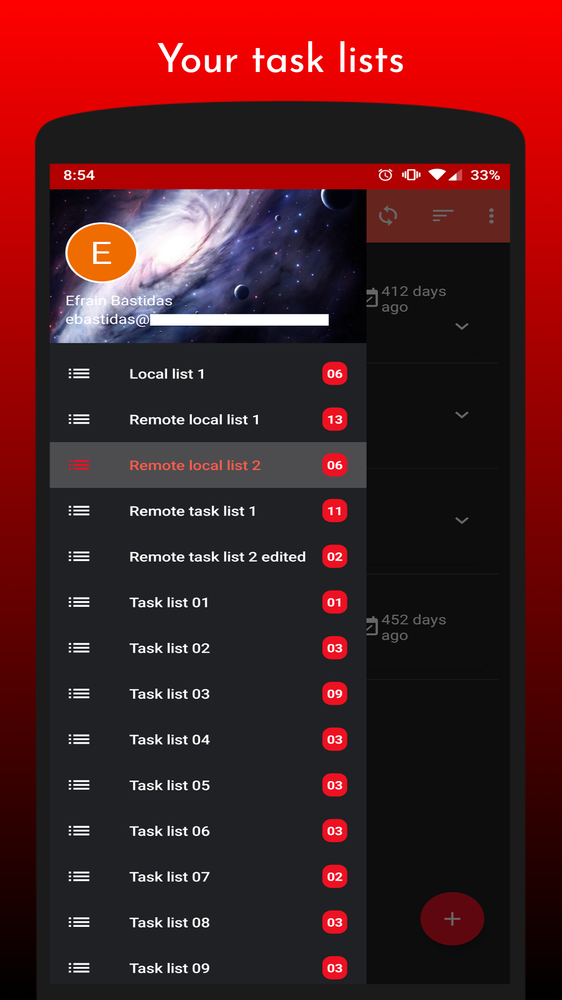
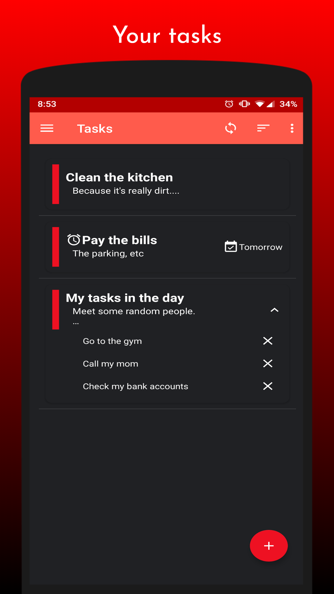

<h1 align="center">Mirai Notes</h1>

  

A simple UWP notes app that provides synchronization with Google Task and can be also used offline.

### Screenshots

#### UWP

  

#### Android

  
  

### Features
* All the Google Task features: 
  *  Create task lists
  * Create task and subtasks
  * Delete/Update/Move tasks and subtasks
  *   Etc...
* Synchronization with Google Tasks
* Offline support
* Themes and accent colors
* Task reminders
* Password protection when the app starts
* And many more...

### Installation
I currently don't have a developer account to publish this app in the Microsoft Store (WIP).... so to install this app:
* Go into the Windows Settings -> Updates & Security ->For Developers
* Select the **Sideload apps** checkbox
* Download the latest version of the app in the [Release section](https://github.com/Wolfteam/MiraiNotes/releases) 
* Decompress the zip file into any folder
* Right-click on the **Add-AppDevPackage.ps1** file. Choose **Run with PowerShell** and follow the prompts. You will be prompted to install my developer certificate and app

* When the app package has been installed, the PowerShell window displays this message: **Your app was successfully installed**. After that just click the Start button to search for the app, and then launch it. 

### Support
If you have any bug report, suggestion, feature request, etc, please go into the [Issues section](https://github.com/Wolfteam/MiraiNotes/issues) and create a new issue. 
>**Note**: I'm looking for a new app icon, if you would like to donate one i won't stop you :D**

### Donations
I hope you are enjoying using this app, If you would like to support my work by buying me a coffee / beer, please send me an email
